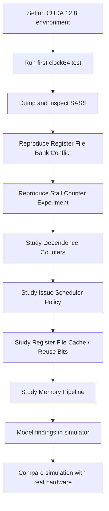

# Dissecting and Modeling Modern GPU Cores — Reproduction

<p align="center">
  <b>From microbenchmarks to reverse engineering modern NVIDIA GPU cores</b>
</p>

<p align="center">
  
  
  
  
</p>

---

## Overview

This repository records my reproduction process for the paper:

> **Dissecting and Modeling the Architecture of Modern GPU Cores**
> MICRO 2025

The goal of this project is not only to run the final simulator evaluation, but to reproduce the paper from the beginning:
starting from small GPU microbenchmarks, reading GPU clock counters, inspecting SASS instructions, and gradually understanding how the paper reverse engineers modern NVIDIA GPU core microarchitecture.

---

## Main Goal

The reproduction is divided into two stages.

### Stage 1: Reverse Engineering Experiments

This is the current focus.

I want to reproduce the small experiments used in the paper to infer GPU core behavior, including:

* GPU `CLOCK` / `clock64()` measurement
* SASS disassembly
* register file bank conflicts
* stall counter behavior
* dependence counters
* issue scheduler policy
* register file cache and reuse bits
* memory pipeline behavior

### Stage 2: Simulator Modeling and Validation

This will be done after the reverse engineering experiments are understood.

The later goal is to study how the discovered microarchitectural details are modeled in the remodeled simulator and compare simulated execution cycles with real hardware.

---

## Hardware and Software Environment

Current local reproduction environment:

| Component    | Version                    |
| ------------ | -------------------------- |
| GPU          | NVIDIA GeForce RTX 5070 Ti |
| Architecture | Blackwell                  |
| OS           | WSL2 Ubuntu 24.04          |
| CUDA Toolkit | 12.8                       |
| Compiler     | `nvcc` 12.8                |
| SASS tools   | `cuobjdump`, `nvdisasm`    |
| Status       | Initial environment ready  |

The original paper also evaluates Blackwell GPUs, so RTX 5070 Ti is a meaningful platform for reproducing the Blackwell-related methodology.

---

## Reproduction Roadmap



---

## Current Progress

* [x] Set up WSL2 Ubuntu 24.04 environment
* [x] Install CUDA Toolkit 12.8
* [x] Verify `nvcc`
* [x] Verify `cuobjdump`
* [x] Verify `nvdisasm`
* [x] Run first `clock64()` microbenchmark
* [x] Dump SASS for the first CUDA kernel
* [ ] Reproduce register file bank conflict experiment
* [ ] Reproduce stall counter experiment
* [ ] Reproduce dependence counter experiment
* [ ] Reproduce issue scheduler experiment
* [ ] Reproduce register file cache experiment
* [ ] Study memory pipeline experiments
* [ ] Study remodeled simulator implementation
* [ ] Run final simulation accuracy evaluation

---

## Repository Structure

```text
modern-gpu-core-reproduce/
├── microbenchmarks/
│   ├── 00_env/
│   ├── 01_clock_test/
│   ├── 02_ptx_add_latency/
│   ├── 03_rf_bank_conflict/
│   ├── 04_stall_counter/
│   ├── 05_dependence_counter/
│   ├── 06_issue_scheduler/
│   ├── 07_register_file_cache/
│   └── 08_memory_pipeline/
│
├── results/
│   └── 5070ti/
│       ├── env.txt
│       ├── clock_test.txt
│       └── clock_test.sass
│
├── notes/
│   ├── 00_paper_overview.md
│   ├── 01_reverse_engineering_method.md
│   ├── 02_control_bits.md
│   ├── 03_register_file.md
│   ├── 04_issue_scheduler.md
│   └── 05_memory_pipeline.md
│
├── scripts/
│   ├── build.sh
│   ├── run.sh
│   └── parse_cycles.py
│
└── README.md
```

---

## First Microbenchmark: Clock Test

The first test verifies that the GPU clock counter can be read inside a CUDA kernel.

Example output:

```text
elapsed cycles = 1
```

The corresponding SASS contains instructions such as:

```sass
CS2UR UR6, SR_CLOCKLO
CS2R  R2,  SR_CLOCKLO
STG.E.64
EXIT
```

This confirms that `clock64()` is compiled into special-register clock read instructions, which is the foundation for later reverse engineering experiments.

---

## Why Start from Microbenchmarks?

The paper does not begin by simply running large benchmarks.
Instead, it uses carefully designed small instruction sequences to test one hypothesis at a time.

The general idea is:

```text
small instruction sequence
→ measure hardware cycles
→ change one variable
→ compare timing or correctness
→ infer microarchitectural behavior
```

This project follows the same methodology.

---

## Planned Experiments

### 1. Register File Bank Conflict

Goal:

Observe whether different source register numbers cause different execution cycles.

Expected idea:

```text
different register bank usage
→ different number of bubbles
→ infer register file bank conflicts
```

---

### 2. Stall Counter

Goal:

Understand how fixed-latency instruction dependencies are handled.

Expected idea:

```text
incorrect stall counter
→ wrong result or shorter latency
correct stall counter
→ correct result and expected cycles
```

---

### 3. Dependence Counters

Goal:

Study how variable-latency instructions such as memory loads are synchronized.

Expected idea:

```text
LDG / memory instruction
→ dependence counter increases
→ consumer waits until counter reaches zero
```

---

### 4. Issue Scheduler Policy

Goal:

Infer which warp is selected for issue in different conditions.

Expected idea:

```text
multiple warps
→ record clock cycles
→ reconstruct issue timeline
```

---

### 5. Register File Cache

Goal:

Study the effect of reuse bits on register file reads.

Expected idea:

```text
reuse bit set
→ operand may hit in register file cache
reuse bit not set
→ operand reads from register file
```

---

### 6. Memory Pipeline

Goal:

Study load/store queue behavior, memory latency, and sub-core contention.

Expected idea:

```text
controlled memory instructions
→ measure cycles
→ infer memory pipeline constraints
```

---

## Notes

This repository is a learning-oriented reproduction project.
Some experiments may not exactly match the paper at the beginning because controlling SASS instructions and control bits requires additional tooling such as SASS modification tools.

The current priority is:

```text
understand the method first
then reproduce each microbenchmark
then study the simulator model
finally reproduce the validation results
```

---

## References

* Rodrigo Huerta, Mojtaba Abaie Shoushtary, José-Lorenzo Cruz, Antonio Gonzalez.
  **Dissecting and Modeling the Architecture of Modern GPU Cores.**
  MICRO 2025.
