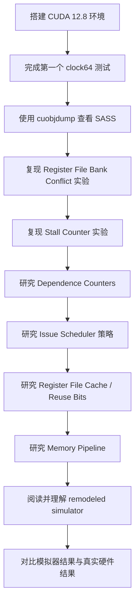

# 现代 GPU Core 逆向建模论文复现

<p align="center">
  <b>从 microbenchmark 到现代 NVIDIA GPU Core 逆向工程</b>
</p>

<p align="center">
  
  
  
  
</p>

---

## 项目简介

本仓库用于记录我对论文：

> **Dissecting and Modeling the Architecture of Modern GPU Cores**
> MICRO 2025

的复现过程。

本项目的目标不是一开始就直接跑最终的 simulator 误差结果，而是从论文最核心的逆向工程方法开始复现：

```text
编写小型 GPU microbenchmark
→ 读取 GPU CLOCK 周期计数器
→ 观察 SASS 指令
→ 修改/分析 control bits
→ 改变单一变量并测量周期变化
→ 反推现代 NVIDIA GPU Core 的微架构行为
→ 最后再研究模拟器建模与 MAPE 误差验证
```

---

## 当前目标

本项目分为两个主要阶段。

### 阶段一：复现逆向工程实验

这是当前阶段的重点。

主要目标是复现论文中用于反推 GPU Core 微架构的小实验，包括：

* GPU `CLOCK` / `clock64()` 周期测量
* SASS 反汇编与指令观察
* Register File bank conflict
* Stall counter 行为
* Dependence counters 行为
* Issue scheduler 策略
* Register File Cache 与 reuse bit
* Memory pipeline 行为

### 阶段二：模拟器建模与验证

在理解逆向实验后，再进一步研究论文如何把这些微架构特征建模进 remodeled simulator 中。

后续目标包括：

* 阅读 remodeled simulator 的实现
* 理解其与原始 Accel-Sim / GPGPU-Sim 模型的区别
* 运行 benchmark
* 对比真实硬件周期与模拟器周期
* 计算 APE / MAPE 误差

---

## 实验环境

当前本地复现实验环境如下：

| 项目           | 配置                         |
| ------------ | -------------------------- |
| GPU          | NVIDIA GeForce RTX 5070 Ti |
| GPU 架构       | Blackwell                  |
| 系统环境         | WSL2 Ubuntu 24.04          |
| CUDA Toolkit | 12.8                       |
| 编译器          | `nvcc` 12.8                |
| SASS 工具      | `cuobjdump`, `nvdisasm`    |
| 当前状态         | CUDA 环境已搭建，基础 CLOCK 测试已完成  |

论文中也对 Blackwell 架构进行了验证，因此 RTX 5070 Ti 可以作为复现 Blackwell 相关实验的重要平台。

---

## 复现路线图



---

## 当前进度

* [x] 搭建 WSL2 Ubuntu 24.04 环境
* [x] 安装 CUDA Toolkit 12.8
* [x] 验证 `nvcc`
* [x] 验证 `cuobjdump`
* [x] 验证 `nvdisasm`
* [x] 完成第一个 `clock64()` microbenchmark
* [x] dump 第一个 CUDA kernel 的 SASS
* [ ] 复现 register file bank conflict 实验
* [ ] 复现 stall counter 实验
* [ ] 复现 dependence counter 实验
* [ ] 复现 issue scheduler 实验
* [ ] 复现 register file cache 实验
* [ ] 研究 memory pipeline 实验
* [ ] 阅读 remodeled simulator 实现
* [ ] 运行最终 simulator accuracy evaluation

---

## 仓库结构

```text
modern-gpu-core-reproduce/
├── microbenchmarks/
│   ├── 00_env/
│   ├── 01_clock_test/
│   ├── 02_ptx_add_latency/
│   ├── 03_rf_bank_conflict/
│   ├── 04_stall_counter/
│   ├── 05_dependence_counter/
│   ├── 06_issue_scheduler/
│   ├── 07_register_file_cache/
│   └── 08_memory_pipeline/
│
├── results/
│   └── 5070ti/
│       ├── env.txt
│       ├── clock_test.txt
│       └── clock_test.sass
│
├── notes/
│   ├── 00_paper_overview.md
│   ├── 01_reverse_engineering_method.md
│   ├── 02_control_bits.md
│   ├── 03_register_file.md
│   ├── 04_issue_scheduler.md
│   └── 05_memory_pipeline.md
│
├── scripts/
│   ├── build.sh
│   ├── run.sh
│   └── parse_cycles.py
│
└── README.md
```

---

## 第一个 Microbenchmark：CLOCK 测试

第一个测试用于验证 CUDA kernel 中是否能够读取 GPU clock counter。

测试输出示例：

```text
elapsed cycles = 1
```

对应的 SASS 中可以看到类似指令：

```sass
CS2UR UR6, SR_CLOCKLO
CS2R  R2,  SR_CLOCKLO
STG.E.64
EXIT
```

这说明 CUDA 中的 `clock64()` 最终会被编译成读取 GPU special register 的 SASS 指令。

这个测试是后续所有逆向工程实验的基础，因为论文的核心方法就是：

```text
在目标指令序列前后读取 CLOCK
→ 计算 elapsed cycles
→ 根据周期变化反推 GPU Core 行为
```

---

## 为什么先做 Microbenchmark？

这篇论文的重点不是单纯跑 benchmark，而是通过非常小、非常可控的指令序列来验证某个硬件假设。

基本方法是：

```text
设计一段很小的指令序列
→ 在真实 GPU 上运行
→ 记录 GPU clock cycles
→ 改变一个变量
→ 对比周期或结果是否变化
→ 反推出微架构行为
```

因此，本项目也按照这个顺序进行复现：

```text
先理解方法
再复现小实验
再研究模拟器建模
最后再做大规模误差验证
```

---

## 后续计划实验

### 1. Register File Bank Conflict

目标：

观察不同源寄存器编号是否会导致不同执行周期。

基本思路：

```text
改变源寄存器编号
→ 观察 elapsed cycles
→ 判断是否发生 register file bank conflict
```

该实验用于理解现代 NVIDIA GPU 中 register file 的 bank 组织方式和读端口冲突。

---

### 2. Stall Counter

目标：

理解固定延迟指令之间的数据依赖如何被处理。

基本思路：

```text
设置错误的 stall counter
→ 程序可能更快但结果错误

设置正确的 stall counter
→ 程序结果正确但周期更长
```

该实验用于理解现代 NVIDIA GPU 中 compiler-assisted dependence management 的核心机制。

---

### 3. Dependence Counters

目标：

研究可变延迟指令，例如 memory load，如何处理数据依赖。

基本思路：

```text
LDG 等 memory instruction
→ 增加 dependence counter
→ 后续 consumer 等待 counter 归零
```

该实验用于理解 SB0 到 SB5 这类 dependence counters 的作用。

---

### 4. Issue Scheduler Policy

目标：

推断 GPU sub-core 中 warp issue scheduler 的调度策略。

基本思路：

```text
构造多个 warp
→ 记录每个 warp 的 CLOCK 时间
→ 还原 issue timeline
→ 推断 scheduler policy
```

该实验用于研究论文中提出的 CGGTY 策略。

---

### 5. Register File Cache

目标：

研究 reuse bit 对 register file read 的影响。

基本思路：

```text
设置 reuse bit
→ 操作数可能命中 register file cache

不设置 reuse bit
→ 操作数需要从 register file 读取
```

该实验用于理解现代 NVIDIA GPU 中软件管理的 register file cache。

---

### 6. Memory Pipeline

目标：

研究 load/store queue、memory latency、sub-core contention 等 memory pipeline 行为。

基本思路：

```text
构造可控 memory instruction 序列
→ 测量执行周期
→ 改变访存宽度、active lanes、warp 数量等变量
→ 推断 memory pipeline 约束
```

---

## 当前阶段总结

目前已经完成：

```text
WSL2 Ubuntu 24.04
CUDA Toolkit 12.8
nvcc / cuobjdump / nvdisasm
RTX 5070 Ti 上的第一个 clock64 测试
SASS dump 验证
```

下一步重点是：

```text
1. 继续写简单 PTX / CUDA microbenchmark
2. 熟悉 SASS 输出
3. 学习如何控制寄存器编号
4. 准备复现论文中的 Register File Bank Conflict 实验
```

---

## 说明

本仓库是一个学习型论文复现项目。

由于论文中的部分实验需要精确控制 SASS 指令和 control bits，因此后续可能需要使用 CUAssembler、NVBit 或其他 SASS 修改工具。

当前阶段不追求一次性复现所有最终数据，而是优先复现论文的研究方法和关键微架构发现过程。

---

## 参考论文

Rodrigo Huerta, Mojtaba Abaie Shoushtary, José-Lorenzo Cruz, Antonio Gonzalez.
**Dissecting and Modeling the Architecture of Modern GPU Cores.**
MICRO 2025.
